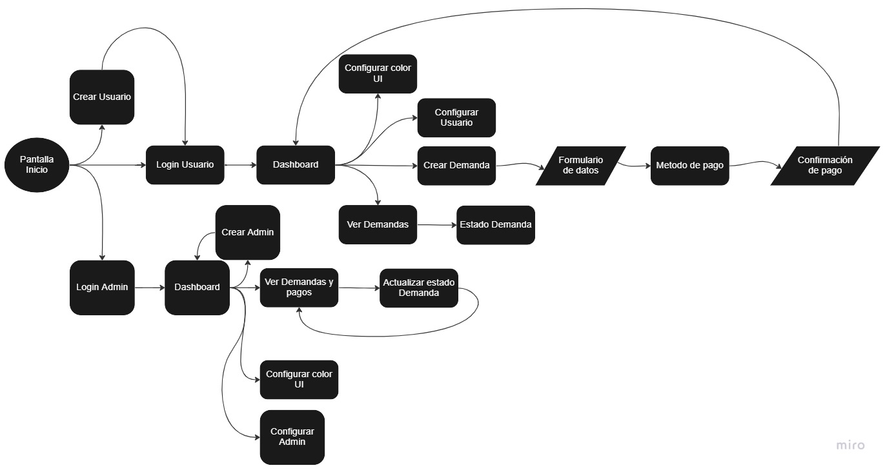
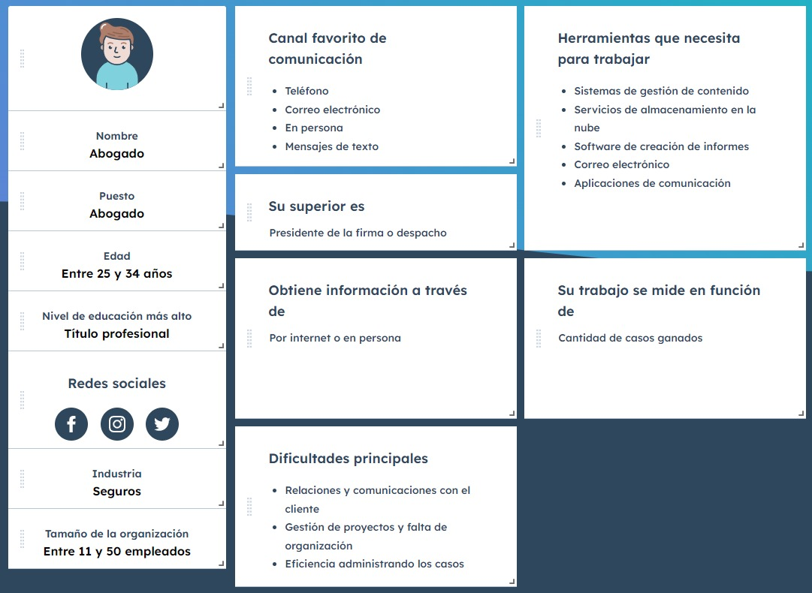
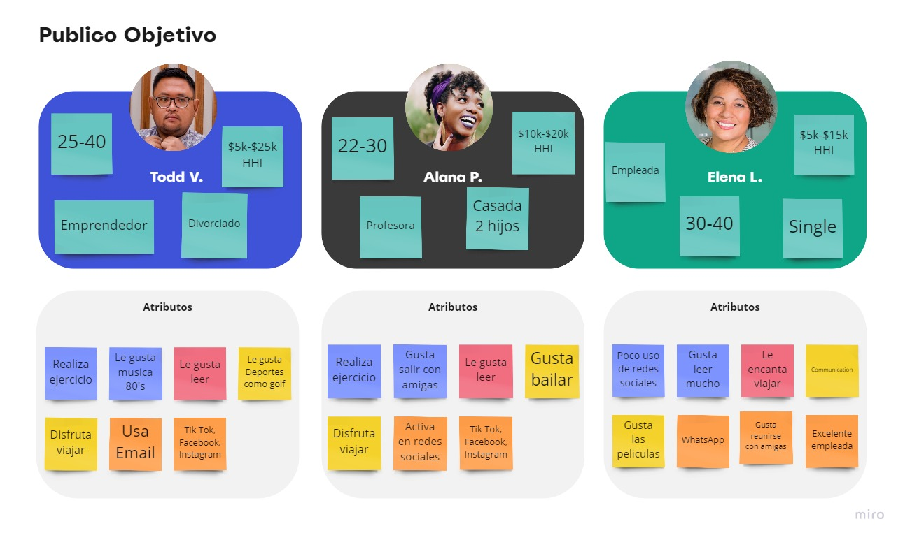
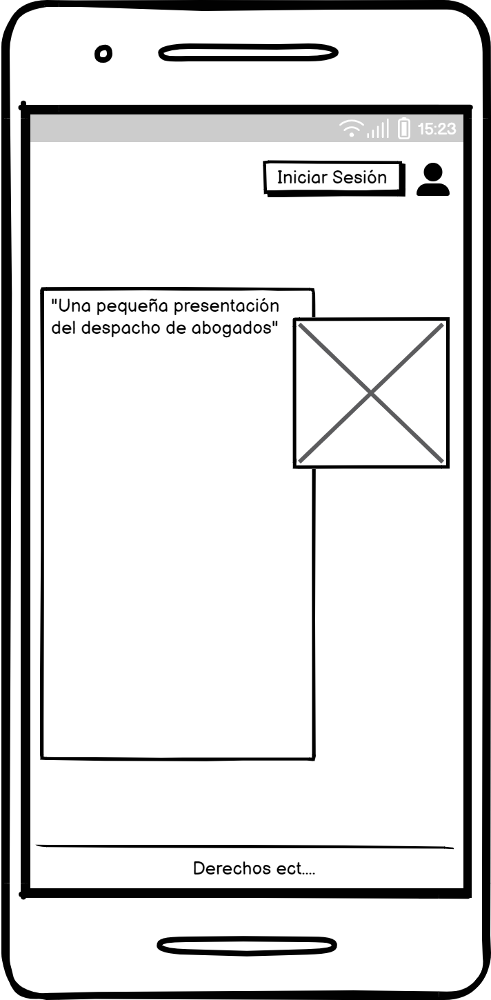
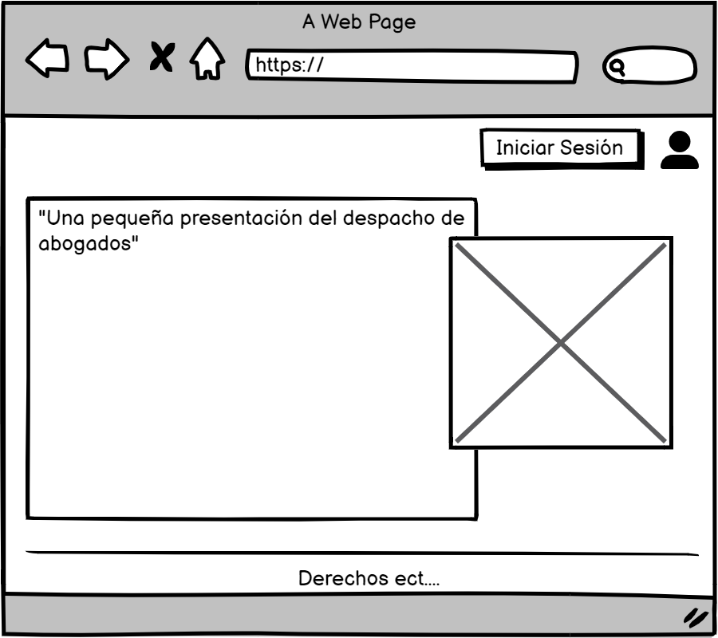
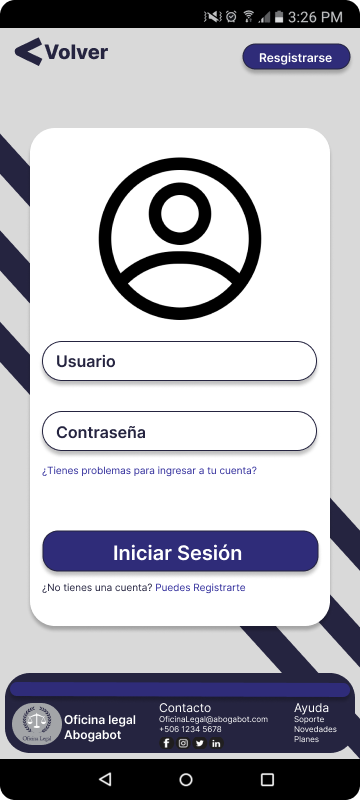
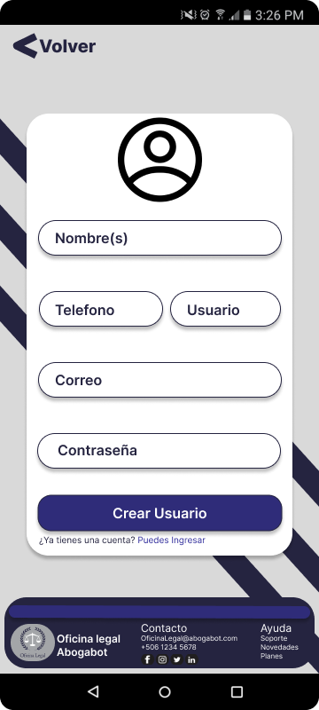
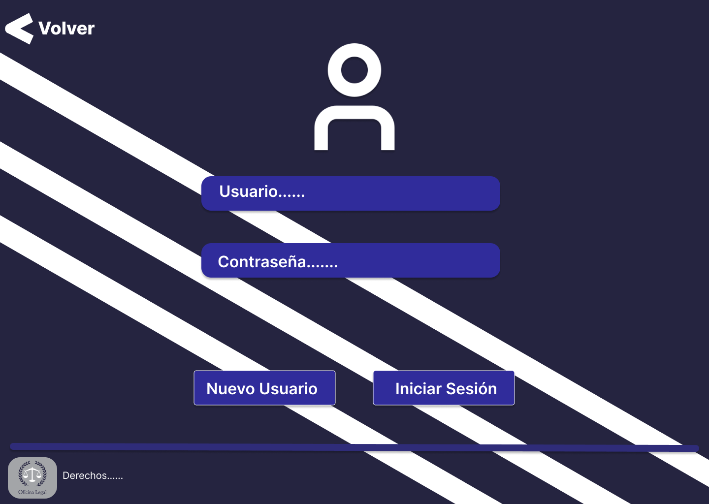
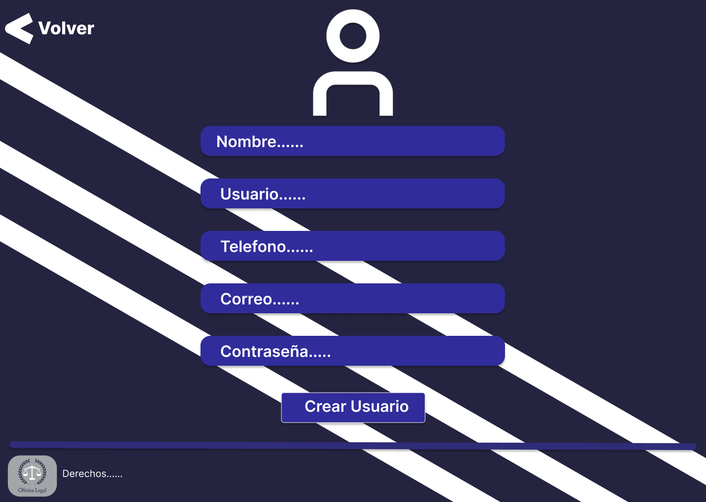

## Toma de requerimentos

***Cliente***

- Creacion de usuario y login

- Dashboard

- Configurar color UI

- Configurar informacion del perfil

- Crear demanda

- Metodo y confirmación

- Ver demandas

- Ver estado y comentarios de demanda

- Notificaión de actualización de demanda

- Responsive para celular

***Admin***

- Creacion de usuario y login

- Dashboard

- Configurar color UI

- Configurar informacion del perfil

- Ver demandas y pagos

- Notificación de nuevas demandas

- Actualizar estado demandas y agregar comentarios

- Responsive para celular

***Diagrama de flujo para la pagina web***

***Buyer Persona***

## Publico objetivo

## WireFrime

***Celular***

- ***Pantalla Inicio***

- [***Usuario***](./Imagenes/WireFrames/Usuario.md)  

- [***Admin***](./Imagenes/WireFrames/Admin.md)

***PC***

- ***Pantalla Inicio***

- [***UsuarioPC***](./Imagenes/WireFramesPC/UsuarioPC.md)  

- [***AdminPC***](./Imagenes/WireFramesPC/AdminPC.md)

## UI

***Celular***

- ***Pantalla Inicio***

- ***Iniciar Sesión***

- ***Nuevo Usuario-Admin***

- [***Usuario***](./Imagenes/UI/UsuarioUI.md)  

- [***Admin***](./Imagenes/UI/AdminUI.md)  

***PC***

- ***Pantalla Inicio***

- ***Iniciar Sesión***

- ***Nuevo Usuario-Admin***

- [***UsuarioPC***](./Imagenes/UIPC/UsuarioUIPC.md)  

- [***AdminPC***](./Imagenes/UIPC/AdminUIPC.md)
